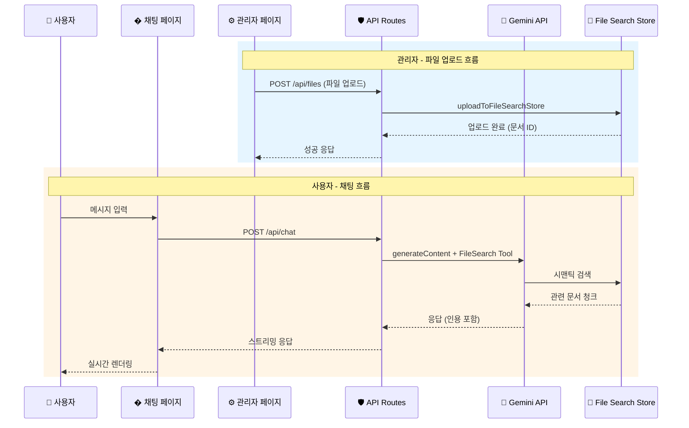

# 🏗️ Architecture: Serverless LLM Chat App with Gemini File Search (Next.js + Vercel)

## 1. 개요 (Overview)
이 문서는 Next.js와 Vercel을 활용한 **Gemini File Search 기반 RAG 채팅 애플리케이션**의 아키텍처를 기술합니다. 

### 핵심 특징
- **이원화된 구조**: 사용자용 **채팅 페이지**와 **관리자 페이지**로 분리
- **Gemini File Search**: Google의 파일 검색 도구를 활용한 시맨틱 검색 기반 RAG
- **Serverless 아키텍처**: Next.js API Routes를 통한 안전한 API Key 관리

---

## 2. 시스템 아키텍처 (System Architecture)

### 전체 구성도

```mermaid
graph TB
    subgraph "👤 사용자"
        U[User Browser]
    end
    
    subgraph "🖥️ Next.js Application"
        subgraph "Frontend"
            CP[채팅 페이지<br/>/chat]
            AP[관리자 페이지<br/>/admin]
        end
        
        subgraph "API Routes (Serverless)"
            CA[/api/chat<br/>채팅 API]
            FA[/api/files<br/>파일 관리 API]
            SA[/api/stores<br/>스토어 관리 API]
        end
    end
    
    subgraph "🤖 Google Gemini API"
        GM[Gemini Model<br/>gemini-2.5-flash]
        FSS[(File Search Store)]
        EM[Embedding Model<br/>gemini-embedding-001]
    end
    
    U --> CP
    U --> AP
    CP --> CA
    AP --> FA
    AP --> SA
    CA --> GM
    CA --> FSS
    FA --> FSS
    FA --> EM
    SA --> FSS
```

### 데이터 흐름 (Data Flow)



---

## 3. 페이지 구조 (Page Structure)

### A. 채팅 페이지 (`/chat`)
**목적**: 일반 사용자가 LLM과 대화하는 인터페이스

| 기능 | 설명 |
|------|------|
| 💬 실시간 채팅 | Streaming 방식의 응답 렌더링 |
| 📚 RAG 기반 답변 | File Search Store의 문서 기반 답변 |
| 📎 인용 표시 | 답변의 출처 문서 표시 |
| 🎨 프리미엄 UI | 다크모드, 애니메이션, 반응형 디자인 |

**디자인 요구사항**:
- Glassmorphism 기반 모던 UI
- 부드러운 타이핑 애니메이션
- 다크/라이트 모드 지원
- 모바일 반응형

### B. 관리자 페이지 (`/admin`)
**목적**: 시스템 관리자가 파일과 스토어를 관리하는 인터페이스

| 기능 | API Endpoint | 설명 |
|------|--------------|------|
| 🔐 API Key 설정 | - | 환경변수 연결 상태 확인 |
| 📁 스토어 생성 | `POST /api/stores` | File Search Store 생성 |
| 📋 스토어 목록 | `GET /api/stores` | 스토어 리스트 조회 |
| 🗑️ 스토어 삭제 | `DELETE /api/stores/:id` | 스토어 삭제 |
| ⬆️ 파일 업로드 | `POST /api/files` | 스토어에 파일 업로드 |
| 📄 파일 목록 | `GET /api/files` | 업로드된 파일 조회 |
| ❌ 파일 삭제 | `DELETE /api/files/:id` | 파일 삭제 |

---

## 4. 기술 스택 (Tech Stack)

| 구분 | 기술 / 서비스 | 선정 이유 |
|------|---------------|-----------|
| **Framework** | Next.js 14+ (App Router) | 프론트엔드/백엔드 통합, Serverless 지원 |
| **Language** | TypeScript | 타입 안정성, 개발 생산성 |
| **Styling** | Tailwind CSS | 빠른 UI 개발, 다크모드 지원 |
| **AI/LLM** | Gemini API | File Search 기능, 한국어 지원 |
| **AI Model** | gemini-2.5-flash | 빠른 응답, File Search 지원 |
| **Embedding** | gemini-embedding-001 | 시맨틱 검색용 임베딩 |
| **Deployment** | Vercel | Next.js 최적화, 자동 배포 |

---

## 5. 디렉토리 구조 (Directory Structure)

```bash
my-chat-app/
├── app/
│   ├── api/
│   │   ├── chat/
│   │   │   └── route.ts          # 채팅 API (Gemini + File Search)
│   │   ├── files/
│   │   │   ├── route.ts          # 파일 업로드/목록 API
│   │   │   └── [id]/
│   │   │       └── route.ts      # 개별 파일 삭제 API
│   │   └── stores/
│   │       ├── route.ts          # 스토어 생성/목록 API
│   │       └── [id]/
│   │           └── route.ts      # 개별 스토어 삭제 API
│   ├── chat/
│   │   └── page.tsx              # [Frontend] 채팅 페이지
│   ├── admin/
│   │   └── page.tsx              # [Frontend] 관리자 페이지
│   ├── components/
│   │   ├── chat/
│   │   │   ├── ChatContainer.tsx # 채팅 컨테이너
│   │   │   ├── ChatInput.tsx     # 메시지 입력
│   │   │   ├── ChatMessage.tsx   # 메시지 말풍선
│   │   │   └── Citation.tsx      # 인용 표시
│   │   └── admin/
│   │       ├── FileUploader.tsx  # 파일 업로드
│   │       ├── FileList.tsx      # 파일 목록
│   │       ├── StoreList.tsx     # 스토어 목록
│   │       └── ApiKeyStatus.tsx  # API 연결 상태
│   ├── page.tsx                  # 랜딩 페이지 (라우팅)
│   └── layout.tsx                # 글로벌 레이아웃
├── lib/
│   ├── gemini.ts                 # Gemini API 클라이언트
│   └── utils.ts                  # 유틸리티 함수
├── .env.local                    # 환경 변수 (API Key)
├── next.config.js
└── package.json
```

---

## 6. API 구현 상세 (API Implementation)

### A. 채팅 API (`/api/chat`)

```typescript
// app/api/chat/route.ts
import { GoogleGenAI } from '@google/genai';
import { NextResponse } from 'next/server';

const ai = new GoogleGenAI({ apiKey: process.env.GEMINI_API_KEY });

export async function POST(req: Request) {
  const { message, storeId } = await req.json();
  
  const response = await ai.models.generateContent({
    model: 'gemini-2.5-flash',
    contents: message,
    config: {
      tools: [{
        fileSearch: {
          fileSearchStoreIds: [storeId]
        }
      }]
    }
  });

  return NextResponse.json({
    text: response.text,
    citations: response.candidates[0].groundingMetadata?.groundingChunks
  });
}
```

### B. 파일 업로드 API (`/api/files`)

```typescript
// app/api/files/route.ts
import { GoogleGenAI } from '@google/genai';

const ai = new GoogleGenAI({ apiKey: process.env.GEMINI_API_KEY });

export async function POST(req: Request) {
  const formData = await req.formData();
  const file = formData.get('file') as File;
  const storeId = formData.get('storeId') as string;
  
  // File Search Store에 직접 업로드
  const document = await ai.fileSearchStores.uploadDocument({
    fileSearchStore: storeId,
    file: file,
    config: { displayName: file.name }
  });

  return NextResponse.json({ document });
}
```

### C. 스토어 관리 API (`/api/stores`)

```typescript
// app/api/stores/route.ts
import { GoogleGenAI } from '@google/genai';

const ai = new GoogleGenAI({ apiKey: process.env.GEMINI_API_KEY });

// 스토어 생성
export async function POST(req: Request) {
  const { displayName } = await req.json();
  
  const store = await ai.fileSearchStores.create({
    config: { displayName }
  });

  return NextResponse.json({ store });
}

// 스토어 목록 조회
export async function GET() {
  const stores = await ai.fileSearchStores.list();
  return NextResponse.json({ stores: Array.from(stores) });
}
```

---

## 7. 환경 변수 (Environment Variables)

```bash
# .env.local
GEMINI_API_KEY=your_gemini_api_key_here
DEFAULT_STORE_ID=fileSearchStores/your-store-id  # 선택사항
```

**보안 주의사항**:
- `.env.local` 파일은 `.gitignore`에 반드시 포함
- Vercel 배포 시 Dashboard > Settings > Environment Variables에 등록
- 클라이언트 코드에 API Key 노출 금지

---

## 8. 지원 파일 형식 (Supported File Types)

Gemini File Search가 지원하는 파일 형식:

| 카테고리 | 형식 |
|----------|------|
| **문서** | PDF, DOCX, PPTX, XLSX, TXT |
| **코드** | JS, PY, JAVA, C, CPP, GO, TS 등 |
| **마크업** | HTML, CSS, MD, JSON, XML |

---

## 9. 배포 가이드 (Deployment Guide)

### 로컬 개발

```bash
# 1. 의존성 설치
npm install @google/genai

# 2. 환경 변수 설정
echo "GEMINI_API_KEY=your_key" > .env.local

# 3. 개발 서버 실행
npm run dev
```

### Vercel 배포

1. GitHub에 코드 푸시
2. Vercel에서 프로젝트 연결
3. Environment Variables에 `GEMINI_API_KEY` 등록
4. 자동 빌드 & 배포

---

## 10. 향후 확장 계획 (Future Enhancements)

- [ ] 멀티 스토어 지원 (주제별 문서 분류)
- [ ] 채팅 히스토리 저장 (DB 연동)
- [ ] 사용자 인증 (NextAuth.js)
- [ ] 파일 업로드 진행률 표시
- [ ] 답변 피드백 시스템